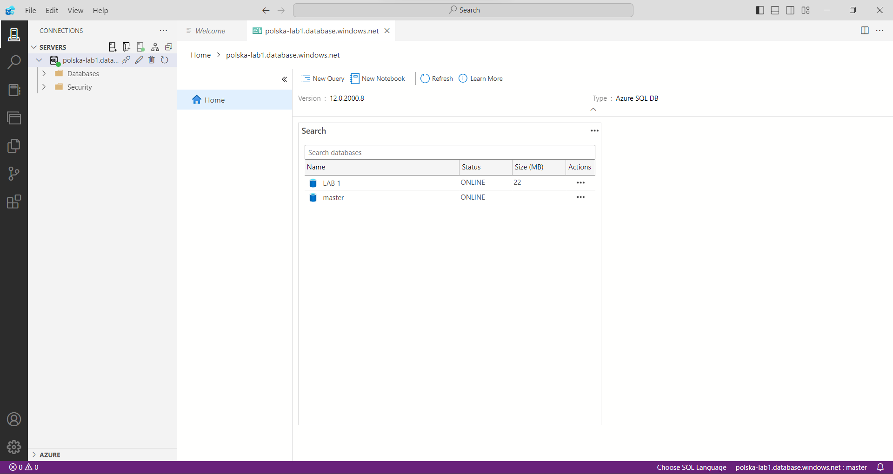
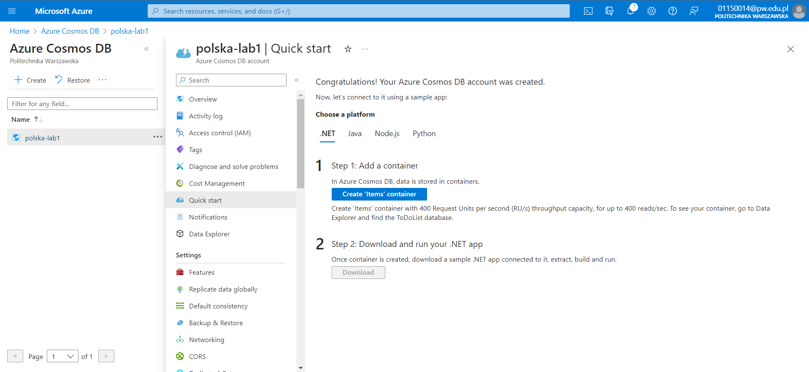
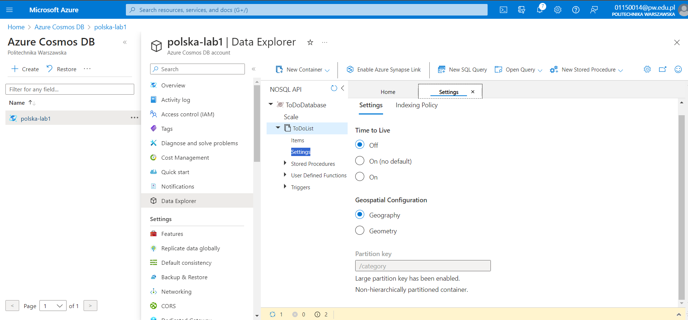
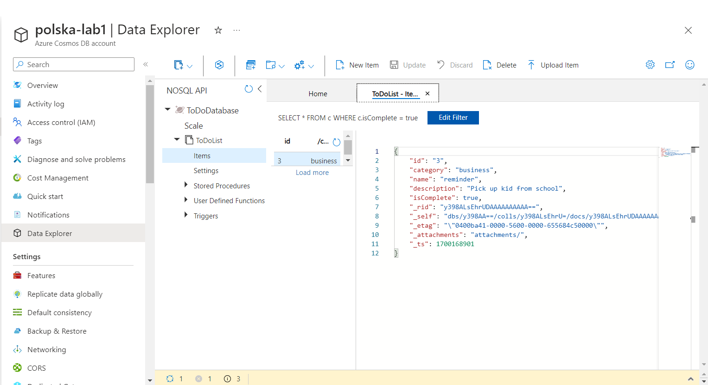
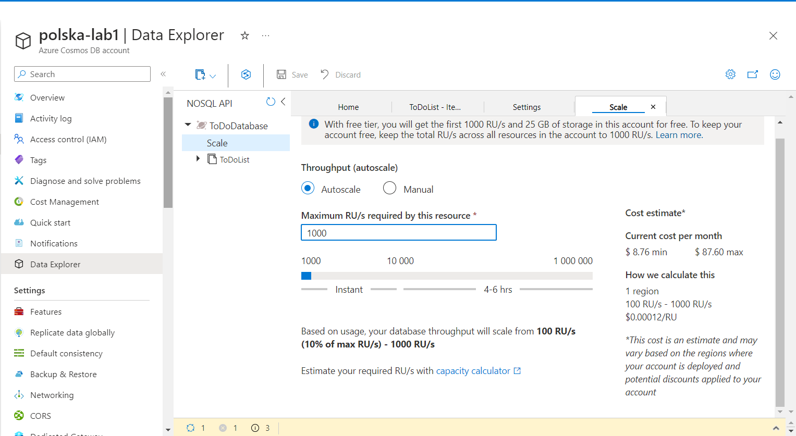

# Programowanie-Uslug-w-Chmurze

Podczas niniejszego laboratorium wykonano kilka ćwiczeń. Pierwsze z nich dotyczy zaznajomienia się z podstawami usługi Azure SQL Database oraz dokonanie kilku fundamentalnych operacji na niej w celu sprawdzenia nabytej wiedzy. Następnie dla utworzonej bazy danych należy skonfigurować zaporę sieciową - Firewall. Ostatnie ćwiczenie dotyczy utworzenia i skonfigurowania bazy nierelacyjnej (na przykładzie bazy dokumentowej) korzystając z usługi Azure Cosmos DB. Dodatkowo, należy zaznajomić się z zarządzaniem skalowalnością oraz z pobieraniem i dodawaniem plików w formacie JSON.

## Ćwiczenie: Baza danych MS SQL Server w Azure
Ćwiczenie rozpoczęto od zarejestrowania się i aktywowanie subskrypcji Politechnicznej.

Następnie za pomocą usługi 'SQL Databases' skonfigurowano i stworzono serwer bazy SQL o nazwie 'LAB 1'.

Poprawną konfigurację i dostęp do bazy sprawdzono w aplikacjach SSMS (SQL Server Management Studio):

Oraz Azure Data Studio:

W kroku 5 napisano skrypt w jęzuky Python (sql.py), który łaczy się z utworzonym serwerem oraz wykonuje fundamentalne instrukcje na relacyjnej bazie danych.

Kolejnym kork jest stworzenie maszyny wirtualnej, oraz skonfigurowanie publicznego dostępu za pomocą HTTP, HTTPS oraz SSH.

Finalnym elementem ćwiczenia jest utworzenie przykładowej tabeli w usłudze Azure Table Storage.

Fundamentalne polecenia CRUD zautomatyzowano za pomocą skryptu w języku Python (table.py).
## Ćwiczenie: Konfiguracja Firewalla Azure SQL Database
Do wykonania ćwiczenia użyto wcześniej przygotowaną bazę - LAB1. Wedle polecenia dodano adres IP (dla bezpieczeństwa zamazane) nowego klienta, a następnie napisano konfigurację, pozwalając na dostęp nowym adresom IP.

## Ćwiczenie: Wprowadzenie do Azure Cosmos DB
Podczas ostatniego ćwiczenia stworzono najpierw konto Azure CosmosDB NOSQL API.

Następnie utworzono bazę 'ToDoDatabase' oraz kontener 'ToDoList' wraz z partycjonowaniem według klucza '/category'.

Za pomocą narzędzia Data Explorer w Azure Portal dodano kilka przykładowych rekordów oraz wykonano zapytanie za pomocą języka CosmosDB.

Badanie możliwości skalowania było niestety niemożliwe, gdyż subskrybcja 'Azure For Students' ograniczala wartość parametru throughput do niezmielaniego 1000 RU/s (wyskakiwał błąd jak na screenie)

